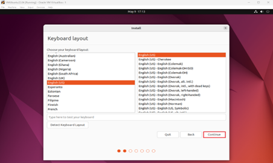

# Getting Started with Virtual Machines: Install Ubuntu 24.04 on Oracle VirtualBox (Windows Host)

[](https://www.virtualbox.org/)
[](https://ubuntu.com/download/desktop)
[](https://www.kernel.org/)
[](https://www.microsoft.com/windows/)

This step-by-step guide is designed for beginners and intermediate users looking to install Ubuntu 24.04 on Oracle VirtualBox running on a Windows host. You'll learn how to download the required software, set up a virtual machine, install Ubuntu, and configure key system settings. By the end, you'll have a working Ubuntu environment and hands-on experience with virtualization and Linux.

---

## Step 1. Download the Packages

1. Download VirtualBox 7.0.18 and the Extension Pack from [VirtualBox Downloads Page](https://www.virtualbox.org/wiki/Downloads).


2. Download Ubuntu 24.04 LTS from [Ubuntu ISO Download Page](https://ubuntu.com/download/desktop).


> **Tip:** Always download the latest stable versions to ensure compatibility and security.

---

## Step 2: Install VirtualBox and Extensions

1. Run the installer as Administrator and follow prompts.  
2. Double-click the Extension Pack to install it.


> **Warning:** Running the installer without administrator privileges may cause installation issues.

---

## Step 3. Create Your Virtual Machine

1. Launch VirtualBox and click **New**.  
2. Select your downloaded Ubuntu ISO.  
3. Name the VM (e.g., UbuntuDevEnv) and skip unattended installation.


4. Assign resources:  
- Memory: 8192 MB  
- Processors: 4  
- Disk: 25+ GB  


5. Finish setup and customize VM:  
- Settings > General > Advanced: Enable bidirectional clipboard + drag-and-drop  


- Settings > Display > Screen: Allocate 128MB video memory, enable 3D acceleration  


- Settings > Network > Adapter 1: Set Adapter 1 to Bridged  


> **Best Practice:** Allocating sufficient resources ensures smooth performance but avoid overcommitting your host machine.

---

## Step 4. Install the Ubuntu 24.04 LTS Image

1. Start your VM and follow the Ubuntu installation flow.




2. Enable third-party drivers and media codecs.


3. Choose **Erase disk and install Ubuntu**, then confirm.


4. Set the time zone and create user credentials.


5. Restart after installation and remove ISO when prompted.


> **Tip:** Back up any important data before choosing to erase disk during installation.

---

## Step 5. Update and Modify System Access

1. Press <kbd>Ctrl</kbd>+<kbd>Alt</kbd>+<kbd>T</kbd> to open the terminal in Ubuntu.  
2. Run the following command to update the package list:

```bash
sudo apt update
```

3. Upgrade all packages:

```bash
sudo apt full-upgrade -y
```

4. Add your user to key groups for admin and device access:

```bash
sudo usermod -aG sudo $USER      # Admin privileges
sudo usermod -aG cdrom $USER     # CD/DVD access
sudo usermod -aG plugdev $USER   # USB and removable drives
sudo usermod -aG dialout $USER   # Serial port access
```

> **Note:** Replace `$USER` with your username if you encounter issues recognizing the variable. You might need to reboot the session for these changes to take effect.

---

## Step 6. Install VirtualBox Guest Additions

1. In the VM window menu, go to:  
   **Devices > Insert Guest Additions CD Image**  
2. In the terminal, install the required packages:

```bash
sudo apt install build-essential dkms linux-headers-$(uname -r)
```

3. Mount and run the installer:

```bash
cd /media/$USER/VBox_GAs_7.0.18
sudo ./VBoxLinuxAdditions.run
```

4. Reboot the system:

```bash
sudo reboot
```

5. Optionally unmount and eject the CD:

```bash
sudo umount /media/$USER/VBox_GAs_7.0.18
eject /dev/sr0
```

> **Note:** Enabling the guest OS screen to auto-resize improves usability. Use the VirtualBox menu bar to activate **Enable Auto-Resize Guest Display**.

---

## Step 8. Create a Shared Folder

1. In VirtualBox:  
   **Devices > Shared Folders > Shared Folders Settings**  
2. Add your host folder with these options:  
- Auto-mount  
- Make Permanent  


3. From the terminal:

```bash
sudo mkdir -p /mnt/VMShared
sudo mount -t vboxsf VMShared /mnt/VMShared
cd /mnt/VMShared
```

---

## Step 9. Uninstall VirtualBox (Optional)

1. Press <kbd>Win</kbd> + <kbd>R</kbd> and type:

```plaintext
appwiz.cpl
```

2. In the Programs and Features window, locate Oracle VM VirtualBox.  
3. Click **Uninstall** and follow the instructions.  
4. Restart your computer if needed.

---

## Summary Checklist

- [ ] Download VirtualBox and Ubuntu ISO  
- [ ] Install VirtualBox and Extension Pack  
- [ ] Create and configure the VM with appropriate resources  
- [ ] Install Ubuntu OS on the VM  
- [ ] Update system and add user to necessary groups  
- [ ] Install VirtualBox Guest Additions for enhanced features  
- [ ] Create shared folders for file exchange  
- [ ] (Optional) Uninstall VirtualBox if no longer needed  

---

You now have a fully functional Ubuntu 24.04 virtual machine running on Windows using Oracle VirtualBox. 
For further learning, consider exploring [VirtualBox Documentation](https://www.virtualbox.org/manual/UserManual.html) and [Ubuntu Official Tutorials](https://ubuntu.com/tutorials).
